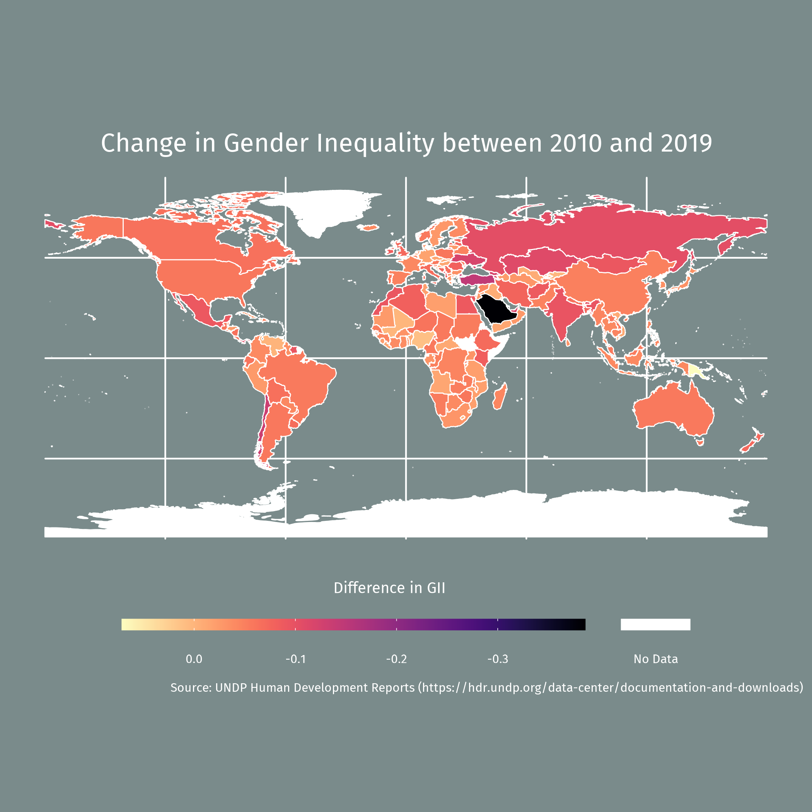

# GIS_Practicals

GitHub working repository for CASA0005 Geographic Information Systems and Science at UCL.  
Practicals followed instructions found at <https://andrewmaclachlan.github.io/CASA0005repo/index.html> by Dr. Andy Machlachlan.

## Recent: Week 4 Homework

Homework for Week 4 can be found at [Week 4](https://github.com/sokimura39/GIS_Practicals/tree/master/Week4).

The final output using the ggplot2 package:

